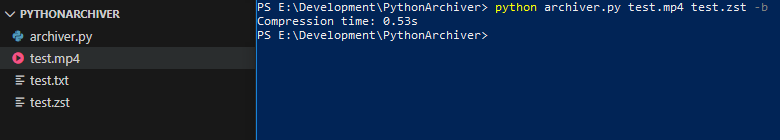
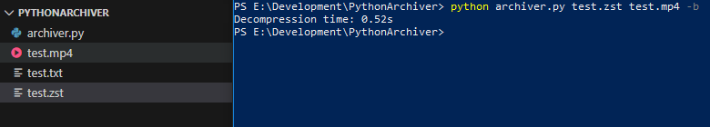
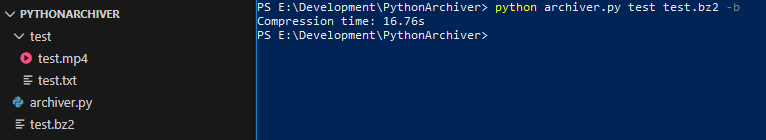
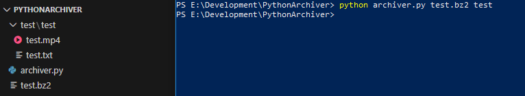

# PythonArchiver
Консольная утилита архиватор/распаковщик, написанная на Python 3.14. На выбор доступно два формата .zst и .bz2.

## Инструкция
Запуск утилиты происходит консольной командой: python archiver.py src trg [-h] [-b]
- src - исходный файл или папка/архив для распаковки
- trg - целевой файл/папка
- -h, --help - показывает справку по ключам
- -b, --benchmark - показывает время выполнения

Архивация файла в .bz2 и вывод затраченного времени
- python archiver.py test.txt test.bz2 -b

## Демонстрация работы

## Архивация файла

## Распаковка файла

## Архивация папки

## Распаковка архива

